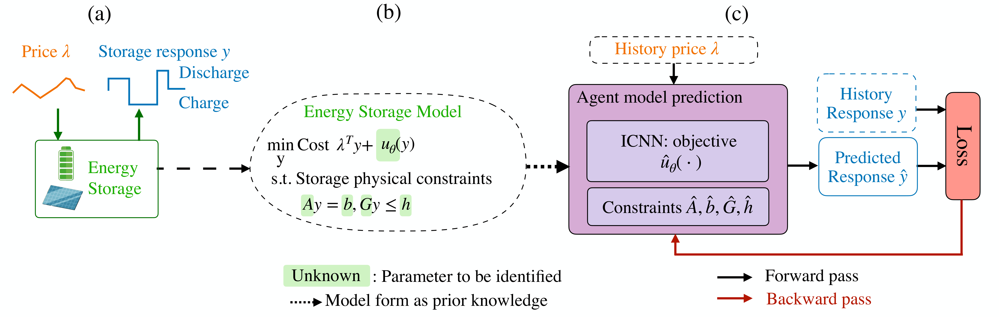

# Predicting Strategic Energy Storage Behaviors

This repository contains the code to reproduce the results. 

We propose a **gradient-based approach** to identify the strategic energy storage behavior model, where the agent is to minimize the energy cost and a disutility cost and satisfying the energy constraints and State-of-charge constraints. We assume the agent disutility function **form** is not known, thus we propose to use input convex neural networks (ICNN) to capture the disutility function. 



## Case study 1. Quadratic energy storage model
```
cd quadraticenergystorage
# Running the baselines (MLP or RNN)
python baseline.py --model MLP
# Running generic model
python train_general.py
```
We also compare the proposed approach using optimization-tools to directly solving the single-level optimization, please see optimization.m for more detail. 


## Case study 2. SoC cost energy storage model
```
cd genericenergystorage
# Running the baselines (MLP or RNN)
python baseline.py --model MLP
# Running generic model
python train_general.py
# Running quadratic model
python train_quadratic.py
```

## Case study 3. Real world dataset 
```
cd Tesla
# Running the baselines (MLP or RNN)
python baseline.py --model MLP
# Running generic model
python train_general.py
# Running quadratic model
python train_quadratic.py
```

